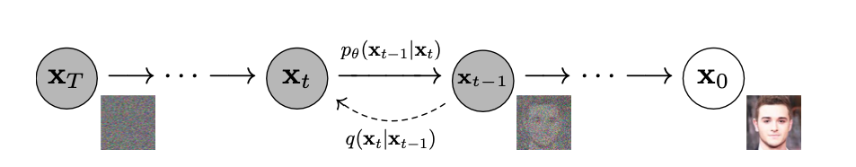

# Introduction

This blog aims to review the physical intuition behind the diffuse
model, systematically summarize the mathematics underlying DDPM and DDIM
models, and examine the algorithms used in guided image generation.

# Physicals of Diffuse Model

The diffuse model draws inspiration from non-equilibrium thermodynamics.
Therefore, understanding the underlying physical processes aids in
grasping the algorithm from a broader perspective.

Now, delving into the physical intuition behind the diffuse model.
Imagining pollen entering a large bottle of water, the pollen gradually
disperse throughout the water through Brownian motion, and eventually
achieving random distribution. The motion of pollen in water can be
described by the Langevin Equation, which can be simplifies to
$$\\label{eq:LE}
x\_{t+\\Delta t}=x\_{t}+\\frac{\\Delta t}{\\gamma}\\Delta E +\\frac{\\Delta t}{\\gamma}\\epsilon_t$$
Here, *Δ**E* is the potential, *γ* is the faction coefficient,
*ϵ**t* is random variable that follows random distribution.
In
<a href="#eq:LE" data-reference-type="ref" data-reference="eq:LE">[eq:LE]</a>
the second term accounts for drift of pollen driven by particle density,
and the third term represents particle’s random motion.

The diffuse model consists of two distinct processes: forward and
reverse (generation). Understanding the diffuse process from the
physical perspective reveals that the forward process mimics the
diffusion of pollen particles in water. During this phase, the diffuse
model consistently introduces random noise into the system. In contrast,
the reverse (generation) process is designed to entirely reverse the
diffusion process, allowing for the collection of pollen. This reversal
entails retracing the movements or distribution of diffusing particles
in the opposite direction, ultimately restoring the initial
configuration.

Mathematically, the reverse process employs Markov processes, stochastic
differential equations (SDEs), or ordinary differential equations (ODEs)
to reconstruct the data distribution from random noise. SDEs and ODEs
are capable of approximating the solutions of discrete Markov processes
since they possess the same marginal distribution.

# Diffuse Models

## Denoising Diffusion Probabilistic Models–DDPM

The denoising probabilistic diffusion model (DDPM) is one the pioneers
of the diffuse model, for which the forward and reverse process are
shown in
<a href="#DDPM" data-reference-type="ref" data-reference="DDPM">1</a>.
In the forward process *q*(*x**t*\|*x**t* − 1),
noise is intentionally introduced into the original image
*x*0, until the image becomes random noise *x**T*.
Conversely, in the reverse process
*p**θ*(*x**t* − 1\|*x**t*), noise is
systematically removed from the noisy image *x**T*, and
ultimately restoring the original image.

<figure>
<figcaption aria-hidden="true">The directed graphical model of DDPM .</figcaption>
</figure>

**Forward Process**: the probability
*q*(*x*1 : *T*\|*x*0) of obtaining
*x**T* from the original image *x*0 is product of
*q*(*x**t*\|*x**t* − 1)
$$q(x\_{1:T}\|x_0)=\\prod\_{t=1}^{T} q(x_t\|x\_{t-1})$$
*q*(*x**t*\|*x**t* − 1) follows normal
distribution:

$$\\label{eq:forward_q}
q(x_t\|x\_{t-1})=N(x_t;\\sqrt{1-\\beta_t}x\_{t-1},\\beta_tI)$$

*β**t* is diffusion rate scheduler, which controls the scale
of the random noise. Expand equation
<a href="#eq:forward_q" data-reference-type="ref" data-reference="eq:forward_q">[eq:forward_q]</a>
$$x_t=\\sqrt{1-\\beta_t}x\_{t-1}+\\sqrt{\\beta_t}\*\\epsilon$$
in which *ϵ* ∼ *N*(0,*I*). In this distribution *N*(0,*I*) the mean is
zero and standard deviation being *I*, and *I* is an identity matrix.
Without going through every single
*q*(*x**t*\|*x**t* − 1), the short cut to
calculate *x**t* from *x*0 is as follows:
$$q(x\_{1:T}\|x_0)=N(x_t;\\sqrt{\\bar{\\alpha_t}},(1-\\bar{\\alpha_t})I)$$
which further simplified to the following equation
$$\\label{eq:forward_xt}
x_t=\\sqrt{\\bar{\\alpha_t}}x_0+\\sqrt{1-\\bar{\\alpha_t}}\\epsilon$$
in the equations *α**t* = 1 − *β**t* and
$\\bar{\\alpha_t}=\\prod\_{s=1}^{t}\\alpha_s$. Therefore without need to
calculate *x**t* in every single step between 0 and *T*, the
equation above can calculate *x**t* in a single step.

In the forward process, the conditional probability function
*q*(*x**t* − 1\|*x**t*,*x*0):
*q*(*x**t* − 1\|*x**t*,*x*0) = *N*(*x**t* − 1;*μ̃**t*(*x**t*,*x*0),*β̃**t**I*)
in which the mean *μ̃**t* follows:
$$\\tilde{\\mu}\_t(x_t,x_0)=\\frac{\\sqrt{\\bar{\\alpha}\_{t-1}}\\beta_t}{1-\\bar{\\alpha}\_t}x_0+
\\frac{\\sqrt{\\alpha\_{t-1}}(1-\\bar{\\alpha}\_{t-1})}{1-\\bar{\\alpha}\_t}x_t$$
and
$$\\tilde{\\beta_t}=\\frac{1-\\bar{\\alpha}\_{t-1}}{1-\\bar{\\alpha}\_t}\\beta_t$$

**Reverse Process**: for the reverse process, the probability
*p**θ*(*x*0 : *T*) from *x**T* to
*x*0 can be expand:
$$p\_{\\theta}(x\_{0:T})=p(x\_{T})\\prod\_{t=1}^{T}p\_{\\theta}(x\_{t-1}\|x\_{t})$$
*p*(*x**T*) follows normal distribution
*N*(*x**T*;0,*I*).
*p**θ*(*x**t* − 1\|*x**t*) follows the
distribution
*p**θ*(*x**t* − 1\|*x**t*) = *N*(*x**t* − 1;*μ**θ*(*x**t*,*t*),*Σ**θ*(*x**t*,*t*))
*Σ**θ*(*x**t*,*t*) = *σ**t*2*I*
therefore
<a href="#eq:reverse_p" data-reference-type="ref" data-reference="eq:reverse_p">[eq:reverse_p]</a>
becomes
*p**θ*(*x**t* − 1\|*x**t*) = *N*(*x**t* − 1;*μ**θ*(*x**t*,*t*),*σ**t*2*I*)
and *σ**t*2 can be *β**t* or
*β̃**t*.

The cost function should be able to lower log-likelihood, when the
generated data belonging to the same distribution as the original data.
Then, the cost function is simplified to calculate the lower bond (VLB)
of log-likelihood:
*L**V**L**B* = *L*0 + ...*L**t* − 1 + ...*L**T*,
*L**T* is constant and it turns out better results are
obtained without *L*0 term. Therefore, the only term left is
*L**t*:
*L**v**l**b* = *D**k**l*(*q*(*x**t* − 1\|*x**t*,*x*0),*p**θ*(*x**t* − 1\|*x**t*))

insert
<a href="#eq:forward_condition_q" data-reference-type="ref" data-reference="eq:forward_condition_q">[eq:forward_condition_q]</a>
and equation
<a href="#eq:reverse_p" data-reference-type="ref" data-reference="eq:reverse_p">[eq:reverse_p]</a>
in to equation
<a href="#eq:loss" data-reference-type="ref" data-reference="eq:loss">[eq:loss]</a>:
$$L\_{t-1}=E_q\[\\frac{1}{2\\sigma_t^{2}}\|\|\\tilde{\\mu}\_t(x_t,x_0)-\\mu\_{\\theta}(x_t,t)\|\|^2\]$$
There are three options from here for parameterize: 1. predict
*x*0 directly 2. predict *μ**θ* 3. predict noise
*ϵ**θ*. DDPM chose to predict *ϵ**θ* through the
following parameterize function:
$$\\begin{aligned}
\\mu\_{\\theta}=\\tilde{\\mu}\_t(x_t,x_0)=\\tilde{\\mu}\_t(x_t,\\frac{1}{\\sqrt{\\bar{\\alpha}}}(x_t-\\sqrt{1-\\bar{\\alpha_t}} \\epsilon\_{\\theta}(x_t))) \\\\
=\\frac{1}{\\sqrt{\\alpha_t}}(x_t-\\frac{\\beta_t}{1-\\bar{\\alpha_t}}\\epsilon\_{\\theta}(x_t,t))
\\end{aligned}$$
therefore
$$x\_{t-1}=\\frac{1}{\\sqrt{\\alpha_t}}(x_t-\\frac{\\beta_t}{1-\\bar{\\alpha_t}}\\epsilon\_{\\theta}(x_t,t))+\\sigma\_{t}z$$
in which *z* ∼ *N*(0,*I*). The resulting loss function becomes
*L**s**i**m**p**l**e*(*θ*) = *E**τ*, *x*0, *ϵ*\[\|\|*ϵ*−*ϵ**θ*(*x**t*,*t*)\|\|2\]
insert
<a href="#eq:forward_xt" data-reference-type="ref" data-reference="eq:forward_xt">[eq:forward_xt]</a>
into
<a href="#eq:loss_simple" data-reference-type="ref" data-reference="eq:loss_simple">[eq:loss_simple]</a>
$$L\_{simple}(\\theta)=E\_{\\tau,x_0,\\epsilon}\[\|\|\\epsilon-\\epsilon\_{\\theta}(\\sqrt{\\bar{\\alpha_t}}x_0+\\sqrt{1-\\bar{\\alpha_t}}\\epsilon,t)\|\|^2\]$$

## Denoising Diffusion Implicit Model–DDIM

Reducing the inference time with DDPM is a critical concern. Denoising
Diffusion Implicit Model (DDIM) solves this problem while also
preserving high-level features deterministically, thus facilitating
noisy space interpolation.

<figure>
<figcaption aria-hidden="true">The graphical model of DDIM .</figcaption>
</figure>

**Forward Process**: the forward process of DDIM maintains the same
format as DDPM
$$\\label{eq:q_forward}
q\_{\\sigma}(x_t\|x\_{t-1})=N(x_t;\\sqrt{1-\\beta_t}x\_{t-1},\\beta_tI)$$

$$x_t=\\sqrt{1-\\beta_t}x\_{t-1}+\\sqrt{\\beta_t}\*\\epsilon$$
in which *ϵ* ∼ *N*(0,*I*).

$$\\begin{aligned}
q\_{\\sigma}(x\_{t-1}\|x_t,x_0)=\\\\
N(
\\sqrt{\\bar{\\alpha}\_{t-1}}x_0+\\sqrt{1-\\bar{\\alpha}\_{t-1}-\\sigma_t^2}\\frac{x_t-\\sqrt{\\bar{\\alpha}\_t}x_0}{\\sqrt{1-\\alpha_t}},
\\sigma_t^2 I
)
\\end{aligned}$$
When *σ**t* = 0, the generative process is DDIM, which is a
deterministic probabilistic process and
*q**σ*(*x**t*\|*x*0) becomes fixed
matrix.

**Reverse Process**: *p*(*x**T*) ∼ *N*(0,*I*) and
$$f\_{\\theta}(x_t,t)=\\frac{(x_t-\\sqrt{1-\\bar{\\alpha}\_t} \\epsilon\_{\\theta}(x_t,t))}{\\sqrt{\\bar{\\alpha}\_t}}$$

$$p\_{\\theta}(x\_{t-1}\|x_t,t)=
\\begin{cases}
N(f\_{\\theta}(x_1,t),\\sigma^2I) &\\text{if $t=1$} \\\\
q\_{\\sigma}(x\_{t-1}\|x_t,f\_{\\theta}(x_t,t)) 
\\end{cases}$$

$$\\begin{aligned}
x\_{t-1}=\\sqrt{\\bar{\\alpha}\_{t-1}}(\\frac{(x_t-\\sqrt{1-\\bar{\\alpha}\_t} \\epsilon\_{\\theta}(x_t,t))}{\\sqrt{\\bar{\\alpha}\_t}})+\\\\
\\sqrt{1-\\bar{\\alpha}\_{t-1}-\\sigma_t^2}\\epsilon\_{\\theta}(x_t,t)+\\sigma_t\\epsilon_t
\\end{aligned}$$
When
$$\\sigma_t=\\sqrt{\\frac{1-\\bar{\\alpha}\_{t-1}}{1-\\bar{\\alpha}\_t}} \\sqrt{\\frac{1-\\bar{\\alpha}\_t}{\\bar{\\alpha}\_{t-1}}}$$
the reverse process corresponds to DDPM. Whereas, when
*σ**t* = 0,
*p**θ*(*x**t* − 1\|*x**t*,*t*) became
deterministic, the reverse process can generate *x*0
according to the scheduling *τ*. *τ* can be smaller then *T*, hence DDIM
can reduce the sampling time. The graphical model is in
<a href="#DDIM" data-reference-type="ref" data-reference="DDIM">2</a>.

## Latent Diffuse Model

Latent diffuse model can further reduced the time of forward and reverse
process though performing the diffuse in the latent space without
reducing the synthesis quality . The architecture of latent diffuse
model is shown in
<a href="#LD" data-reference-type="ref" data-reference="LD">3</a>. The
latent diffuse model include two stages, the first stage contains a VAE
or VQGAN model. The encoder *ε* encoded *x* into the latent space *z*,
the decoder *D* decode *z* into the image space. In the second stage,
forward and reverse diffusion happens in the latent space *z*, hence
reducing the training and inference time. The conditions are added to
the diffusion model after embedded using encoder *τ**θ*, the
encoded conditions are query in the cross-attention layers of the
modified Unet *ϵ**θ* model.

<figure>
<figcaption aria-hidden="true">The architecture of latent diffuse model </figcaption>
</figure>

# Conditioned Diffuse Model and Guided Generation

The conditional diffuse model depends not only on *x**t* and
*t* but also on the external condition *c*. Guided diffusion is employed
in the generation process to direct the conditional diffuse model. This
guidance encompasses classifier guidance, where another model needs to
be trained to provide guidance using its gradient . On the other hand,
classifier-free guidance does not necessitate the training of additional
models. Instead, classifier-free guidance jointly trains the conditional
and unconditional models, enabling the model to learn to capture the
condition guidance .

## Classier Guidance

In the classifier-guided diffuse model , an additional classifier model
*p**ϕ* needs to be trained to guide the generation process.
Specifically, the derivative of the log probability is injected into the
reverse process to guide generation. The following equation demonstrates
the modification of the reverse process of the DDPM model:
*x**t* − 1 ∼ *N*(*μ**t*+*s*∇*x**t**l**o**g**p**ϕ*(*c*\|*x**t*),*Σ**t*)
in which s is the scaling factor that controls the strength of guidance
and *l**o**g**p**ϕ*(*c*\|*x**t*) is log
probability of classifier model. Meanwhile, the reverse process of DDIM
follow the equations below:
$$\\hat{\\epsilon}={\\epsilon}(x_t)-\\sqrt{1-\\bar{\\alpha_t}}\\nabla\_{x_t}logp\_{\\phi}(c\|x_t)$$

$$x\_{t-1}=\\sqrt{\\bar{\\alpha}\_{t-1}}
\\frac{x_t-\\sqrt{1-\\bar{\\alpha_t}}\\hat{\\varepsilon}}{\\bar{\\alpha_t}}+\\sqrt{1-\\bar{\\alpha}\_{t-1}}\\hat{\\varepsilon}$$

## Classifier-Free Guidance

In the classifier-free guidance process , there is no need to train an
additional model. Instead, the conditional and unconditional diffuse
models are jointly trained. The condition *c* will be randomly replaced
with ∅ during training, with the noise model following the equation
below

*ϵ̄**θ*(*x**t*\|*c*) = *ϵ**θ*(*x**t*\|∅) + *s*(*ϵ**θ*(*x**t*\|*c*)−*ϵ**θ*(*x**t*\|∅))
in which *s* is the guidance scale. The classifier-free guidance guides
the generation process by leveraging the disparity between conditional
generation and unconditional generation outcomes.

## References
Cao, H., Tan, C., Gao, Z., Xu, Y., Chen, G., Heng, P.-A., and Li, S. Z. A survey on generative diffusion model. arXiv preprint arXiv:2209.02646, 2022.

Dhariwal, P. and Nichol, A. Diffusion models beat gans on image synthesis. Advances in neural information processing systems, 34:8780–8794, 2021.
Esser, P., Rombach, R., and Ommer, B. Taming transformers for high-resolution image synthesis. In Proceedings of the IEEE/CVF conference on computer vision and pattern recognition, pp. 12873–12883, 2021.

Ho, J. and Salimans, T. Classifier-free diffusion guidance. arXiv preprint arXiv:2207.12598, 2022.

Ho, J., Jain, A., and Abbeel, P. Denoising diffusion proba- bilistic models. Advances in neural information process- ing systems, 33:6840–6851, 2020.

Nichol, A., Dhariwal, P., Ramesh, A., Shyam, P., Mishkin, P., McGrew, B., Sutskever, I., and Chen, M. Glide: Towards photorealistic image generation and editing with text-guided diffusion models. arXiv:2112.10741, 2021. arXiv preprint

Razavi, A., Van den Oord, A., and Vinyals, O. Generating diverse high-fidelity images with vq-vae-2. Advances in neural information processing systems, 32, 2019.

Rombach, R., Blattmann, A., Lorenz, D., Esser, P., and Ommer, B. High-resolution image synthesis with latent diffusion models. In Proceedings of the IEEE/CVF con- ference on computer vision and pattern recognition, pp. 10684–10695, 2022. 

Sohl-Dickstein, J., Weiss, E., Maheswaranathan, N., and Ganguli, S. Deep unsupervised learning using nonequi- librium thermodynamics. In International conference on machine learning, pp. 2256–2265. PMLR, 2015.

Song, J., Meng, C., and Ermon, S. Denoising diffusion implicit models. arXiv preprint arXiv:2010.02502, 2020.

