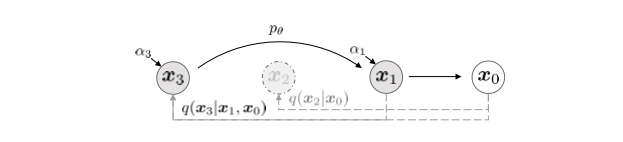

# Introduction

This blog aims to review the physical intuition behind the diffuse model, systematically summarize the mathematics underlying DDPM and DDIM models, and examine the algorithms used in guided image generation.

# Physics Underline Diffuse Model
The diffuse model draws inspiration from non-equilibrium thermodynamics (Sohl-Dickstein et al., 2015). Therefore, understanding the underlying physical processes aids in grasping the algorithm from a broader perspective. 

Now, delving into the physical intuition behind the diffuse model. Imagining pollen entering a large bottle of water, the pollen gradually disperse throughout the water through Brownian motion, and eventually achieving random distribution. The motion of pollen in water can be described by the Langevin Equation, which can be simplifies to 

$$x_{t+\Delta t}=x_{t}+\frac{\Delta t}{\gamma}\Delta E +\frac{\Delta t}{\gamma}\epsilon_t \tag{1} $$

Here, \\(\Delta E\\) is the potential, \\(\gamma\\) is the faction coefficient, \\(\epsilon_t\\) is random variable that follows random distribution. In Equation (1) the second term accounts for drift of pollen driven by particle density, and the third term represents particle's random motion.

The diffuse model consists of two distinct processes: forward and reverse (generation). Understanding the diffuse process from the physical perspective reveals that the forward process mimics the diffusion of pollen particles in water. During this phase, the diffuse model consistently introduces random noise into the system. In contrast, the reverse (generation) process is designed to entirely reverse the diffusion process, allowing for the collection of pollen. This reversal entails retracing the movements or distribution of diffusing particles in the opposite direction, ultimately restoring the initial configuration.

Mathematically, the reverse process employs Markov processes, stochastic differential equations (SDEs), or ordinary differential equations (ODEs) to reconstruct the data distribution from random noise. SDEs and ODEs are capable of approximating the solutions of discrete Markov processes since they possess the same marginal distribution. (Cao et al., 2022)

# Diffuse Models
## Denoising Diffusion Probabilistic Models--DDPM

The denoising probabilistic diffusion model (DDPM) (Ho et al., 2020) is one the pioneers of the diffuse model, for which the forward and reverse process are shown in Figure 1. In the forward process \\(q(x_t\|x_{t-1})\\), noise is intentionally introduced into the original image \\(x_0\\), until the image becomes random noise \\(x_T\\). Conversely, in the reverse process \\(p_{\theta}(x_{t-1}\|x_t)\\), noise is systematically removed from the noisy image \\(x_T\\), and ultimately restoring the original image. 

**Forward Process**: the probability \\(q(x_{1:T}\|x_0)\\) of obtaining \\(x_T\\) from the original image \\(x_0\\) is product of \\(q(x_t\|x_{t-1})\\)

$$q(x_{1:T}|x_0)=\prod_{t=1}^{T} q(x_t|x_{t-1}) \tag{2} $$

\\(q(x_t\|x_{t-1})\\) follows normal distribution:

$$q(x_t\|x_{t-1})=N(x_t;\sqrt{1-\beta_t}x_{t-1},\beta_tI) \tag{3} $$

\\(\beta_t\\) is diffusion rate scheduler, which controls the scale of the random noise. Expand Equation (3)

$$x_t=\sqrt{1-\beta_t}x_{t-1}+\sqrt{\beta_t}*\epsilon \tag{4} $$

in which \\(\epsilon \sim N(0,I)\\). In this distribution \\((N(0,I)\\) the mean is zero and standard deviation being \\(I\\), and \\(I\\) is an identity matrix. Without going through every single 
\\(q(x_t\|x_{t-1})\\), the short cut to calculate \\(x_t\\) from \\(x_0\\) is as follows:

$$q(x_{1:T}|x_0)=N(x_t;\sqrt{\bar{\alpha_t}},(1-\bar{\alpha_t})I) \tag{5} $$

which further simplified to the following equation

$$x_t=\sqrt{\bar{\alpha_t}}x_0+\sqrt{1-\bar{\alpha_t}}\epsilon \tag{6} $$

in the equations \\(\alpha_t=1-\beta_t\\) and \\(\bar{\alpha_t}=\prod_{s=1}\alpha_s\\). Therefore without need to calculate \\(x_t\\) in every single step between 0 and \\(T\\), the equation above can calculate \\(x_t\\) in a single step. 

In the forward process, the conditional probability function \\(q(x_{t-1}\|x_t,x_0)\\):

$$q(x_{t-1}|x_t,x_0)=N(x_{t-1};\hat{\mu}_t(x_t,x_0),\hat{\beta}_tI) \tag{7} $$

in which the mean \\(\hat{\mu}_t\\) follows

$$\hat\mu_t(x_t,x_0)=\frac{\sqrt{\bar\alpha_{t-1}}\beta_t}{1-\bar\alpha_t}x_0+\frac{\sqrt{\alpha_{t-1}}(1-\bar\alpha_{t-1})}{1-\bar\alpha_t}x_t \tag{8} $$

and 

$$\hat{\beta_t}=\frac{1-\bar{\alpha}_{t-1}}{1-\bar{\alpha}_t}\beta_t \tag{9} $$

**Reverse Process**: for the reverse process, the probability \\(p_\theta(x_{0:T})\\) from \\(x_T\\) to \\(x_0\\) can be expand:

$$p_{\theta}(x_{0:T})=p(x_{T})\prod_{t=1}^{T}p_{\theta}(x_{t-1}|x_{t}) \tag{10} $$

\\(p(x_{T})\\) follows normal distribution \\(N(x_T;0,I)\\). \\(p_{\theta}(x_{t-1}\|x_{t})\\) follows the distribution

$$p_{\theta}(x_{t-1}|x_{t})=N(x_{t-1};\mu_{\theta}(x_{t},t),\Sigma_{\theta}(x_t,t)) \tag{11} $$

$$\Sigma_{\theta}(x_t,t)=\sigma_{t}^{2}I \tag{12} $$

therefore Equation (11) becomes

$$p_{\theta}(x_{t-1}|x_{t})=N(x_{t-1};\mu_{\theta}(x_{t},t),\sigma_{t}^{2}I) \tag{13} $$

and \\(\sigma_{t}^{2}\\) can be \\({\beta}_t\\) or \\(\tilde\beta_t\\).

The cost function should be able to lower log-likelihood, when the generated data belonging to the same distribution as the original data. Then, the cost function is simplified to calculate the lower bond (VLB) of log-likelihood: \\(L_{VLB}=L_{0}+...L_{t-1}+...L_{T}\\), \\(L_{T}\\) is constant and it turns out better results are obtained without \\(L_{0}\\) term. Therefore, the only term left is \\(L_{t}\\):

$$L_{vlb}=D_{kl}(q(x_{t-1}|x_t,x_0),p_{\theta}(x_{t-1}|x_{t})) \tag{14} $$

insert Equation (7) and equation Equation (11) in to equation Equation (14): 

$$L_{t-1}=E_q[\frac{1}{\sigma_t^{2}}||\hat\mu_t(x_t,x_0)-\mu_{\theta}(x_t,t)||^2] \tag{15} $$

There are three options from here for parameterize: 1. predict \\(x_0\\) directly 2. predict \\(\mu_{\theta}\\) 3. predict noise \\(\epsilon_{\theta}\\). DDPM chose to predict \\(\epsilon_{\theta}\\) through the following parameterize function:

$$\mu_{\theta}=\hat\mu_t(x_t,x_0)=\frac{1}{\sqrt{\alpha_t}}(x_t-\frac{\beta_t}{1-\bar\alpha_t}\epsilon_{\theta}(x_t,t)) \tag{16} $$

therefore 

$$x_{t-1}=\frac{1}{\sqrt{\alpha_t}}(x_t-\frac{\beta_t}{1-\bar{\alpha_t}}\epsilon_{\theta}(x_t,t))+\sigma_{t}z \tag{17} $$

in which \\(z \sim N(0,I)\\). The resulting loss function becomes

$$L_{simple}(\theta)=E_{\tau,x_0,\epsilon}[||\epsilon-\epsilon_{\theta}(x_t,t)||^2] \tag{18} $$

insert Equation (6) into Equation (18)

$$L_{simple}(\theta)=E_{\tau,x_0,\epsilon}[||\epsilon-\epsilon_{\theta}(\sqrt{\bar{\alpha_t}}x_0+\sqrt{1-\bar{\alpha_t}}\epsilon,t)||^2] \tag{19} $$

## Denoising Diffusion Implicit Model--DDIM
Reducing the inference time with DDPM is a critical concern. Denoising Diffusion Implicit Model (DDIM) (Song et al., 2020) solves this problem while also preserving high-level features deterministically, thus facilitating noisy space interpolation.

**Forward Process**: the forward process of DDIM maintains the same format as DDPM

$$q_{\sigma}(x_t|x_{t-1})=N(x_t;\sqrt{1-\beta_t}x_{t-1},\beta_tI) \tag{20} $$

$$x_t=\sqrt{1-\beta_t}x_{t-1}+\sqrt{\beta_t}*\epsilon \tag{21} $$

in which \\(\epsilon \sim N(0,I)\\).

$$q_{\sigma}(x_{t-1}|x_t,x_0)=N(\sqrt{\bar\alpha_{t-1}}x_0+\sqrt{1-\bar\alpha_{t-1}-\sigma_t^2}\frac{x_t-\sqrt{\bar\alpha_t}x_0}{\sqrt{1-\alpha_t}},\sigma_t^2 I) \tag{22} $$

When \\(\sigma_{t}=0\\), the generative process is DDIM, which is a deterministic probabilistic process and \\(q_{\sigma}(x_t\|x_0)\\) becomes fixed matrix.

**Reverse Process**: \\(p(x_T)\sim N(0,I)\\) and 

$$f_{\theta}(x_t,t)=\frac{x_t-\sqrt{1-\bar\alpha_t}\epsilon_{\theta}(x_t,t)}{\sqrt{\bar\alpha_t}} \tag{23} $$

if $t=1$, $$p_{\theta}(x_{t-1}\|x_t,t)=N(f_{\theta}(x_1,t),\sigma^2I)$$ 

else 

$$q_{\sigma}(x_{t-1}\|x_t,f_{\theta}(x_t,t)) \tag{24} $$

$$x_{t-1}=\sqrt{\bar\alpha_{t-1}}\frac{x_t-\sqrt{1-\bar\alpha_t}\epsilon_{\theta}(x_t,t)}{\sqrt{\bar\alpha_t}}+(\sqrt{1-\bar\alpha_{t-1}}-{\sigma_t}^2)\epsilon_\theta(x_t,t)+\sigma_t{\epsilon}_t \tag{25} $$

When 

$$\sigma_t=\sqrt{\frac{1-\bar\alpha_{t-1}}{1-\bar\alpha_t}}\sqrt{\frac{1-\bar\alpha_t}{\bar\alpha_{t-1}}} \tag{26} $$

the reverse process corresponds to DDPM. Whereas, when \\(\sigma_{t}=0\\), \\(p_{\theta}(x_{t-1}\|x_t,t)\\) became deterministic, the reverse process can generate \\(x_0\\) according to the scheduling \\(\tau\\). \\(\tau\\) can be smaller then \\(T\\), hence DDIM can reduce the sampling time. The graphical model is in Figure 2.

## Latent Diffuse Model
Latent diffuse model can further reduced the time of forward and reverse process though performing the diffuse in the latent space without reducing the synthesis quality (Rombach et al., 2022). The architecture of latent diffuse model is shown in Figure 3. The latent diffuse model include two stages, the first stage contains a VAE (Razavi et al., 2019) or VQGAN  (Esser et al., 2021) model. The encoder \\(\varepsilon\\) encoded \\(x\\) into the latent space \\(z\\), the decoder \\(D\\) decode \\(z\\) into the image space. In the second stage, forward and reverse diffusion happens in the latent space \\(z\\),  hence reducing the training and inference time. The conditions are added to the diffusion model after embedded using encoder \\(\tau_{\theta}\\), the encoded conditions are query in the cross-attention layers of the modified Unet \\(\epsilon_{\theta}\\) model.

# Conditioned Diffuse Model and Guided Generation
The conditional diffuse model depends not only on \\(x_t\\) and \\(t\\) but also on the external condition \\(c\\).  Guided diffusion is employed in the generation process to direct the conditional diffuse model. This guidance encompasses classifier guidance, where another model needs to be trained to provide guidance using its gradient (Nichol et al., 2021; Dhariwal & Nichol, 2021). On the other hand, classifier-free guidance does not necessitate the training of additional models. Instead, classifier-free guidance jointly trains the conditional and unconditional models, enabling the model to learn to capture the condition guidance (Ho & Salimans, 2022).

## Classier Guidance
In the classifier-guided diffuse model (Dhariwal & Nichol, 2021), an additional classifier model 
\\(p_{\phi}\\) needs to be trained to guide the generation process. Specifically, the derivative of the log probability is injected into the reverse process to guide generation. The following equation demonstrates the modification of the reverse process of the DDPM model: 
$$x_{t-1} \sim N(\mu_t+s\nabla_{x_t} log p_{\phi}(c|x_t),\Sigma_t) \tag{27} $$
in which s is the scaling factor that controls the strength of guidance and \\(log p_{\phi}(c|x_t)\\) is log probability of classifier model. Meanwhile, the reverse process of DDIM follow the equations below:

$$\hat\epsilon=\epsilon(x_t)-\sqrt{1-\bar\alpha_t}\nabla_{x_t}logp_{\phi}(c|x_t) \tag{28} $$

$$x_{t-1}=\sqrt{\bar\alpha_{t-1}}(\frac{x_t-\sqrt{1-\bar\alpha_t}\hat\varepsilon}{\bar\alpha_t})+\sqrt{1-\bar\alpha_{t-1}}\hat{\varepsilon} \tag{29} $$

## Classifier-Free Guidance
In the classifier-free guidance process (Ho & Salimans, 2022), there is no need to train an additional model. Instead, the conditional and unconditional diffuse models are jointly trained. The condition $c$ will be randomly replaced with \\(\emptyset\\) during training, with the noise model following the equation below

$$\bar\epsilon_{\theta}(x_t|c)=\epsilon_{\theta}(x_t|\emptyset)+s(\epsilon_{\theta}(x_t|c)-\epsilon_{\theta}(x_t|\emptyset)) \tag{30} $$

in which \\(s\\) is the guidance scale. The classifier-free guidance guides the generation process by leveraging the disparity between conditional generation and unconditional generation outcomes.

## References
Cao, H., Tan, C., Gao, Z., Xu, Y., Chen, G., Heng, P.-A., and Li, S. Z. A survey on generative diffusion model. arXiv preprint arXiv:2209.02646, 2022.

Dhariwal, P. and Nichol, A. Diffusion models beat gans on image synthesis. Advances in neural information processing systems, 34:8780–8794, 2021.
Esser, P., Rombach, R., and Ommer, B. Taming transformers for high-resolution image synthesis. In Proceedings of the IEEE/CVF conference on computer vision and pattern recognition, pp. 12873–12883, 2021.

Ho, J. and Salimans, T. Classifier-free diffusion guidance. arXiv preprint arXiv:2207.12598, 2022.

Ho, J., Jain, A., and Abbeel, P. Denoising diffusion proba- bilistic models. Advances in neural information process- ing systems, 33:6840–6851, 2020.

Nichol, A., Dhariwal, P., Ramesh, A., Shyam, P., Mishkin, P., McGrew, B., Sutskever, I., and Chen, M. Glide: Towards photorealistic image generation and editing with text-guided diffusion models. arXiv:2112.10741, 2021. arXiv preprint

Razavi, A., Van den Oord, A., and Vinyals, O. Generating diverse high-fidelity images with vq-vae-2. Advances in neural information processing systems, 32, 2019.

Rombach, R., Blattmann, A., Lorenz, D., Esser, P., and Ommer, B. High-resolution image synthesis with latent diffusion models. In Proceedings of the IEEE/CVF con- ference on computer vision and pattern recognition, pp. 10684–10695, 2022. 

Sohl-Dickstein, J., Weiss, E., Maheswaranathan, N., and Ganguli, S. Deep unsupervised learning using nonequi- librium thermodynamics. In International conference on machine learning, pp. 2256–2265. PMLR, 2015.

Song, J., Meng, C., and Ermon, S. Denoising diffusion implicit models. arXiv preprint arXiv:2010.02502, 2020.

